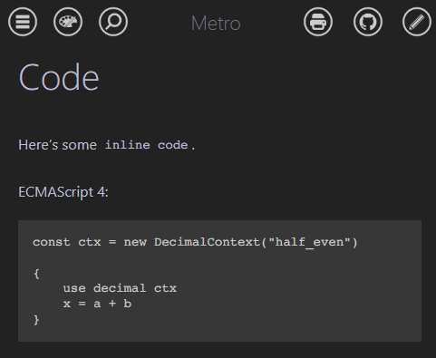

# Metro mdBook theme

<p align="center">
  <a href="https://sweaxizone.github.io/metro-mdbook/demo"></a>
</p>

A nice Metro design language based theme for mdBook.

[A demo.](https://sweaxizone.github.io/metro-mdbook/demo)

## Preview



## Getting started

Requisites:

- mdBook 0.5.2 (newer patches *may be* compatible)

Run:

```sh
git clone https://github.com/sweaxizone/metro-mdbook com.sweaxizone.metro
```

Configure to point to that theme's `theme/` directory on your book manifest:

```toml
[output.html]
theme = "com.sweaxizone.metro/theme"
```

Also add the following to the manifest:

```toml
[output.html]
hash-files = false
```

## Development

Browse https://github.com/rust-lang/mdBook/tree/master/crates/mdbook-html/front-end and compare what has changed in
mdBook frontend's default files.

## License

Apache 2.0